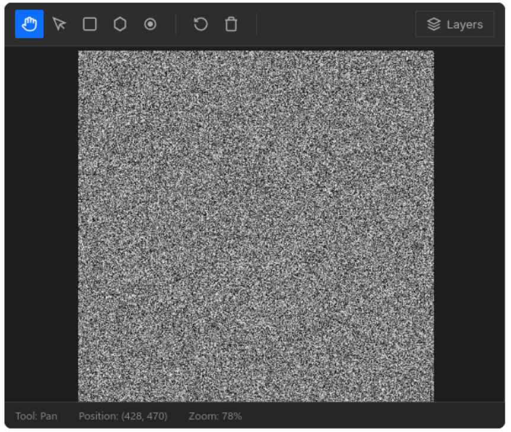
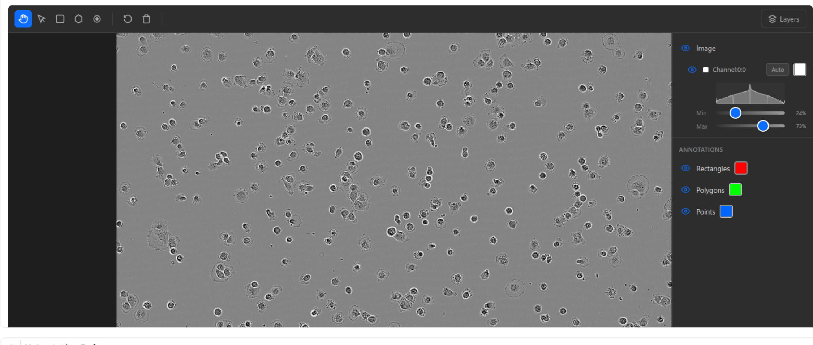
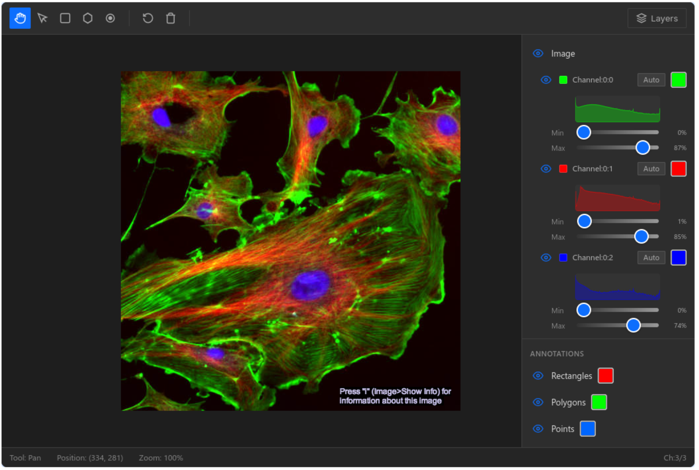
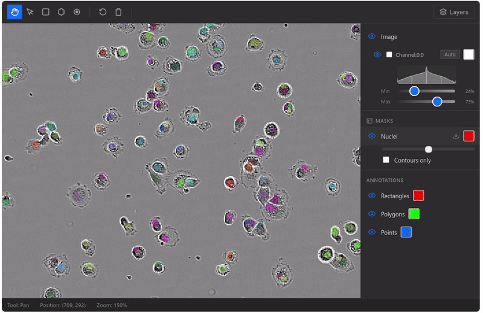
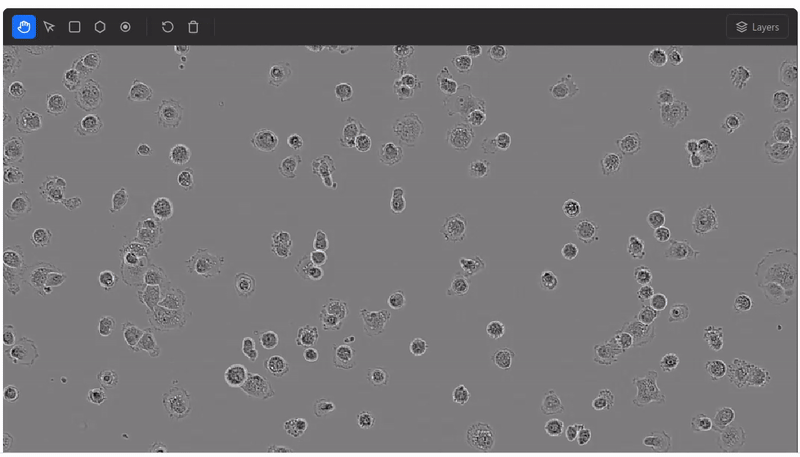

# anybioimage

[](https://pypi.org/project/anybioimage/)
[](https://pypi.org/project/anybioimage/)
[](https://molab.marimo.io/github/maartenpaul/anybioimage/blob/main/examples/anybioimage_notebook_demo.py)
[](https://mybinder.org/v2/gh/maartenpaul/anybioimage/HEAD?urlpath=%2Fdoc%2Ftree%2Fexamples%2Fjupyter%2Fanybioimage_example.ipynb)

Interactive bioimage viewer widget for Jupyter and marimo notebooks. Built on [anywidget](https://anywidget.dev), it supports multi-dimensional images, multi-channel composites, mask overlays, annotation tools, and HCS plate navigation.

Documentation: https://maartenpaul.github.io/anybioimage/

## Installation

```bash
uv pip install anybioimage

# With all recommended dependencies (excludes SAM/PyTorch)
uv pip install "anybioimage[all]"

# With SAM support (Python 3.10–3.12, requires PyTorch)
uv pip install "anybioimage[complete]"
```

## Try anybioimage online
If you want to try `anybioimage` without any installation you can make use of [molab](https://molab.marimo.io) . Open the demo notebook, login to fork the notebook and run anybioimage directly in your browser.   
[anybioimage_notebook_demo.py](https://molab.marimo.io/github/maartenpaul/anybioimage/blob/main/examples/anybioimage_notebook_demo.py)

Or run it in jupyterlab on mybinder.org: [anybioimage_example.ipynb](https://mybinder.org/v2/gh/maartenpaul/anybioimage/HEAD?urlpath=%2Fdoc%2Ftree%2Fexamples%2Fjupyter%2Fanybioimage_example.ipynb)

## Quick Start

### Minimal example (NumPy only)

```python
import numpy as np
from anybioimage import BioImageViewer

viewer = BioImageViewer()
viewer.set_image(np.random.randint(0, 255, (512, 512), dtype=np.uint8))
viewer  # displays in notebook
```



### Example with a tiff image

```python
from anybioimage import BioImageViewer
from bioio import BioImage
import bioio_tifffile

viewer = BioImageViewer()
viewer.set_image(BioImage("image.tif", reader=bioio_tifffile.Reader))
viewer  # renders inline
```


### marimo

```python
import marimo as mo
from anybioimage import BioImageViewer
from bioio import BioImage
import bioio_tifffile

viewer = BioImageViewer()
viewer.set_image(BioImage("image.tif", reader=bioio_tifffile.Reader))
mo.ui.anywidget(viewer)
```

## Features

### Multi-dimensional images

Supports 5D arrays (TCZYX: Time, Channel, Z-stack, Y, X) with sliders for T, Z, and per-channel controls. Pass a `BioImage` object for lazy loading — efficient for large TIFF and OME-Zarr files.

```python
from bioio import BioImage
import bioio_tifffile
import bioio_ome_zarr

img = BioImage("image.tif",  reader=bioio_tifffile.Reader)
viewer.set_image(img)  # activates T/Z sliders, per-channel LUT controls
```



### Multi-channel composites

Each channel has independent color, brightness/contrast (LUT), and visibility controls via the **Layers** panel in the toolbar. Channel settings can also be set programmatically:

```python
# Access and modify channel settings
settings = list(viewer._channel_settings)
settings[0] = {**settings[0], "name": "DAPI", "color": "#0000ff"}
viewer._channel_settings = settings
```


### Mask overlays

Add segmentation masks as overlay layers with configurable color, opacity, and contour rendering:

```python
viewer.add_mask(labels, name="Nuclei", color="#ff0000", opacity=0.5)

# Manage masks
viewer.update_mask_settings(mask_id, opacity=0.3)
viewer.remove_mask(mask_id)
viewer.clear_masks()
```



### HCS plate support

Load OME-Zarr HCS plates with well and FOV navigation dropdowns built into the widget:

```python
viewer = BioImageViewer()
viewer.set_plate("plate.zarr")
viewer  # shows Well / FOV dropdowns
```

### Annotation tools

| Tool | Shortcut | Description |
|------|----------|-------------|
| Pan | `P` | Navigate and zoom |
| Select | `V` | Select annotations; `Delete` to remove |
| Rectangle | `R` | Draw bounding boxes |
| Polygon | `G` | Click vertices, double-click to close |
| Point | `O` | Place point markers |

Export annotations as DataFrames:

```python
viewer.rois_df      # rectangles: id, x, y, width, height
viewer.polygons_df  # polygons: id, points, num_vertices
viewer.points_df    # points: id, x, y
```

### SAM integration

Automatic segmentation with [Segment Anything Model](https://segment-anything.com) when drawing rectangles or placing points:

```python
viewer.enable_sam(model_type="mobile_sam")  # ~40 MB, fastest
viewer.enable_sam(model_type="sam_b")       # SAM base, ~375 MB
```

Requires `uv pip install "anybioimage[sam]"` (Python 3.10–3.12).



## Rendering backends

| Backend | Default | Best for |
|---|---|---|
| `canvas2d` | ✅ | Local arrays, BioImage/TIFF/CZI/ND2, full annotation & SAM toolset |
| `viv` | opt-in | OME-Zarr — remote URLs browser-direct; local / S3 / GCS stores via the kernel chunk bridge (any size, zarr v2 + v3) |

```python
# Opt in to the Viv backend for OME-Zarr:
viewer = BioImageViewer(render_backend="viv")
viewer.set_image("https://example.com/data.ome.zarr")
viewer.set_plate("https://example.com/plate.zarr")  # well/FOV switching stays browser-side

viewer.set_image("/data/big.ome.zarr")                                        # local, any size
viewer.set_image("s3://bucket/x.ome.zarr", storage_options={"anon": True})   # needs anybioimage[remote]
```

Non-zarr inputs on the `viv` backend fall back to Canvas2D automatically (one info log).
Alpha limitations on Viv-rendered images: annotation/SAM tools, brightness/contrast
sliders, histograms, and the toolbar Reset-view button are inactive (use per-channel
min/max for contrast); they remain fully functional on the Canvas2D backend.
Set `render_backend="canvas2d"` (default) to retain the full annotation and SAM toolset.

### Attribution

The Viv backend builds on [Viv](https://github.com/hms-dbmi/viv) (MIT),
[deck.gl](https://deck.gl) (MIT), and Viv's zarr loader (zarr.js lineage, MIT).

## Optional dependencies

| Extra | Installs | Use case |
|-------|----------|----------|
| `bioio` | `bioio`, `bioio-tifffile` | TIFF / OME-Zarr loading |
| `contours` | `scipy` | Contour-only mask rendering |
| `sam` | `ultralytics` (PyTorch) | SAM segmentation |
| `all` | bioio + contours | Recommended (no PyTorch) |
| `complete` | all + sam | Everything |

## License

MIT
